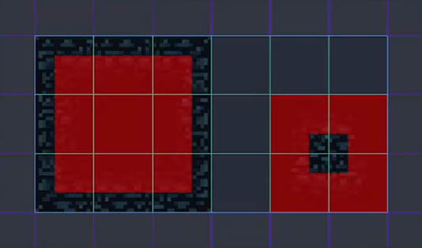
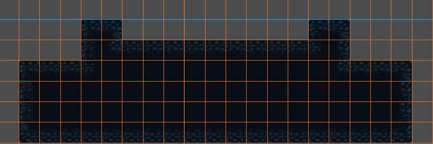

# 基础地图制作

简单记录2D场景下的`TileMap`制作

## 新建TileMap过程中可能存在的问题

教程使用的`TileMap`是在Godot3.x版本中常用的，在Godot4.x版本中如果你使用它则旁边会出现一个黄色感叹号告诉你这个老旧的`TileMap`以后会被弃用

不过这里因为我发现4.4.1的版本中虽然显示会被弃用，但是仍然可以使用旧版的`TileMap`，为了防止后续跟进教程的过程中出现配置不一的问题，这里我直接使用旧版的`TileMap`

## TileSet配置

由`TileMap`新建`TileSet`并拖入地图材质，这里教程做了一些针对自动图块相关的配置，但是我这里用的是4.x版本似乎是直接自动识别配置好了，所以就不需要这一步

之后为图块添加碰撞体，3.x中本身有添加碰撞体的快捷图标，4.x中我是通过在“检查器”中的“Physics Layers”下添加碰撞相关的属性再在“绘制”中完成的

然后调整掩码，这个掩码可以帮助图块在绘制地图时的自动填充，4.x中这个掩码是通过配置地形集属性然后绘制来完成的  

## 掩码的绘制规则

掩码用于自动填充地图时判断图块的连接方式。对于掩码规则我的简单理解是：如果对应方向的接壤图块不为空，则画上掩码

你可以在 Godot 4.x 的 TileSet 编辑器中通过“地形集”属性，点击对应的掩码格子来绘制这些规则，实现自动连接和填充

示例图：

```plaintext
⬛⬛⬛
⬛⬜⬜
⬛⬜⬜
```

表示自己、右边、下边和右下角的图块不为空，其他是空

例如教程中绘制的结果是这样的：



这里对于图中右边这块的掩码绘制要注意，你不能看这个图块在地图集中的相对位置是怎样的，要看正确的地图图案下各个图块的相对位置来画掩码

更多详细规则可以参考官方文档：[Godot TileSet 地形掩码](https://docs.godotengine.org/zh_CN/latest/tutorials/2d/using_tilemaps.html#terrain-sets)

## 结果展示

配置完掩码之后就可以随便画了，图块会自动调整相互之间的连接关系和图案：


