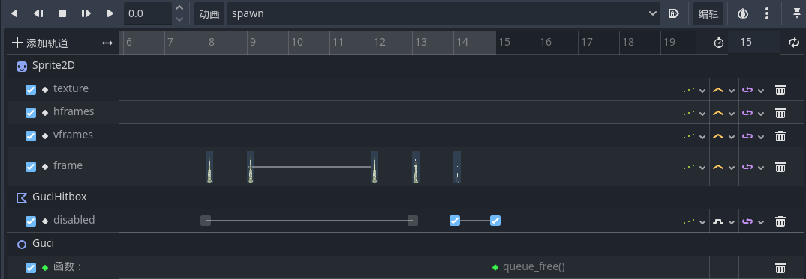

# BOSS的下戳

## 状态切换

同样，以随机概率的方式为下戳相关的动作提供一个触发的可能：

```GDScript
if randf() < 0.7:
    if abs(playerPosition.x - global_position.x) < 80:
        call_deferred("change_state", State.HUIKAN_ZHUNBEI)
    else:
        if randf() > 0.5:
            call_deferred("change_state", State.MOVE)
        else:
            call_deferred("change_state", State.JUMP)
else:
    call_deferred("change_state", State.JUMP_2)
```

而触发下戳之后的动作由三部分组成：起跳、下戳准备、下戳、下戳结束、骨刺生成

## 起跳与下戳

起跳过程其实和普通跳跃差不多，动画也是相同的，不过这里由于起跳到了顶点会触发之后下戳的相关动作因此没有原始跳跃过程中的下落部分的位移，那么想让BOSS起跳之后更接近小骑士可以把原始跳跃的速度改大一点：

```GDScript
func process_jump_2(delta):
    if isStateNew:
        velocity.x = (playerPosition.x - global_position.x) * 2
        velocity.y = -400
        $AnimationPlayer.play("跳跃")
    velocity.y += gravity * delta
    move_and_slide()
    if velocity.y > 0:
        call_deferred("change_state", State.XIACHUO_ZHUNBEI)
```

起跳完成到最高点之后进入下戳准备状态，此时只需要播放动画就可以了，可以把BOSS的速度先停下来，相当于一个动作的前摇，给玩家反应时间，下戳准备结束之后播放下戳动画并添加竖直方向速度让BOSS快速落地，之后进入下戳结束动画并生成骨刺

## 骨刺

新建场景，制作骨刺并链接到主场景，制作关键帧动画，设置碰撞体，可以通过动画来控制骨刺各个状态的持续时间，并在骨刺动画播放完毕之后删除它



之后控制骨刺在BOSS的左右的固定范围内按一定间隔生成，并在生成循环中使用`await`控制其逐个生成：

```GDScript
func spawn_guci():
    var boss = get_node("/root/MainScene/Enemy/BOSS")
    var guci_scene = load("res://scenes/guci.tscn")
    for i in range(10):
        var guci_node_right = guci_scene.instantiate()
        guci_node_right.position.x = boss.position.x + 45 + 45 * i
        guci_node_right.position.y = 0
        if guci_node_right.position.x > -500 and guci_node_right.position.x < -240:
            add_child(guci_node_right)
        var guci_node_left = guci_scene.instantiate()
        guci_node_left.position.x = boss.position.x - 45 - 45 * i
        guci_node_left.position.y = 0
        if guci_node_left.position.x > -500 and guci_node_left.position.x < -240:
            add_child(guci_node_left)
        await get_tree().create_timer(0.2).timeout
```

> [!Tip]
> 在Godot4中要使用`instantiate()`，原视频教程中的`instance()`是Godot3中的写法
