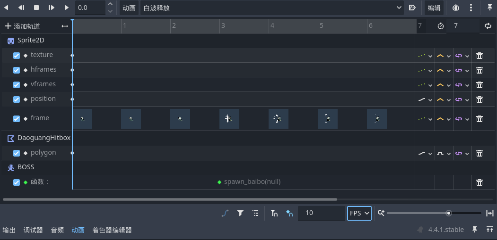

# BOSS的白波和冲刺

## 状态机切换

之前有提过“后跳”是为了衔接白波和冲刺，那么现在在之前做好的后跳加上两个基于概率的分支分别执行白波和冲刺两种攻击方式即可

## 白波

这里我们为白波制作节点，配置动画等相关信息，然后写一个生成白波的方法（以单方向为例，反向同理）：

```GDScript
func spawn_baibo_left():
    var boss = get_node("/root/MainScene/Enemy/BOSS")
    var baibo_scene = load("res://scenes/baibo.tscn")
    var baibo_node_left = baibo_scene.instantiate()
    baibo_node_left.position.x = boss.position.x - 20
    baibo_node_left.position.y = boss.position.y
    baibo_node_left.scale.x = 1
    baibo_node_left.direction = 1
    add_child(baibo_node_left)
```

这里的逻辑是加载资源生成白波场景对象之后配置其相关参数然后加入到`Baibo_Spawner`的子节点中，而`Baibo_Spawner`是在主场景`MainScene`里的，由此在白波释放的动画的关键帧中调用生成白波的函数即可在播放到对应帧时候生成白波对象



视频教程中处理完白波释放和生成以及其移动和碰撞之后就结束了。但是我们回想一下之前章节里面的骨刺制作，当时的骨刺生成和调用逻辑和白波其实是类似的，但是当时我们在骨刺的关键帧动画中做了一个`queue_free()`操作在骨刺生命周期结束后释放这个对象，而在教程的这一章节中作者似乎忘记这样做了

> [!Warning]
> 这里生成的白波对象如果没有消除，那么它飞出屏幕外之后该对象所占用的计算资源依旧没有释放，如果你此时运行游戏并在“远程”节点树中监控节点信息，会发现白波节点越积累越多，导致内存泄漏

针对这个问题我自己琢磨了一种解决方案，在白波子弹飞出屏幕外一定距离后把它释放：

```GDScript
# 检查子弹是否在边界内
var is_inside = (global_position.x > min_x) && (global_position.x < max_x) && (global_position.y > min_y) && (global_position.y < max_y)

if not is_inside:
    ...
    queue_free()
```

这里我们让他飞出一定范围后再释放而不是达到边缘就直接删除，不然白波可能看上去会消失的有点突然

```GDScript
var margin = 100 # 边缘冗余，防止过早销毁
var half_width = viewport_width / 2
var half_height = viewport_height / 2
```

> [!Important]
> 关键：在判断白波到底有没有飞到视角之外的时候，你不能直接用`get_viewport_rect()`得到的视口`rect`来判断是否框住了白波，而要换算到游戏中的世界坐标系来判断

```GDScript
# 相机当前的世界坐标
var cam_x = camera.global_position.x
var cam_y = camera.global_position.y

# 世界坐标下的可见区域边界
var min_x = cam_x - half_width - margin
var max_x = cam_x + half_width + margin
var min_y = cam_y - half_height - margin
var max_y = cam_y + half_height + margin
```

这样，当你再次运行游戏并打开远程节点树观察会发现白波的生命周期正常了

## 冲刺

制作过程和之前的攻击动作类似，就是注意下在冲刺之前转向面对小骑士，并记得冲刺要在战斗区域边界停下来就好
