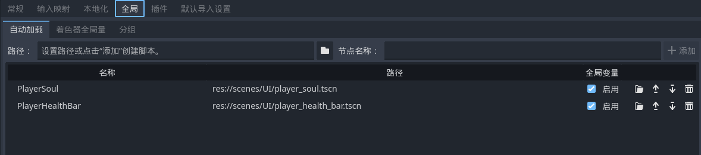

# 灵魂槽和血量条

为小骑士加上蓝条和血条

## CanvasLayer

新建场景，新建`CanvasLayer`节点，这是绘制在另一个画布上的节点，可以固定在屏幕的指定位置，为它制作灵魂槽1-10/血量条1-10的动画，并在脚本中指定不同数值对应的动画

> [!Tip]
> 一般来说游戏中设计血条/蓝条的时候可以给一个基础动画单元，通过代码逻辑来实现其增减，这里原视频教程是为了方便少写点逻辑便于理解所以对每个状态的血条/蓝条都单独制作了一个动画。这在实际开发中并不推荐因为这意味着需要加载更多的动画资源

## 自动加载

我们对灵魂槽和血条启用自动加载，而不是手动链接节点到主场景：



启动游戏会发现灵魂槽和血量条直接就存在了，不需要手动使用代码控制存在等

## 链接小骑士

设计好灵魂槽和血量条之后我们要联动逻辑到小骑士的受击、攻击等

```GDScript
$"/root/PlayerHealthBar".PlayerHealthBar -= 1
$"/root/PlayerHealthBar".refresh_player_health_bar()
```

之后运行游戏，就能实现受击时候血量减少，攻击打中灵魂增加的效果了
