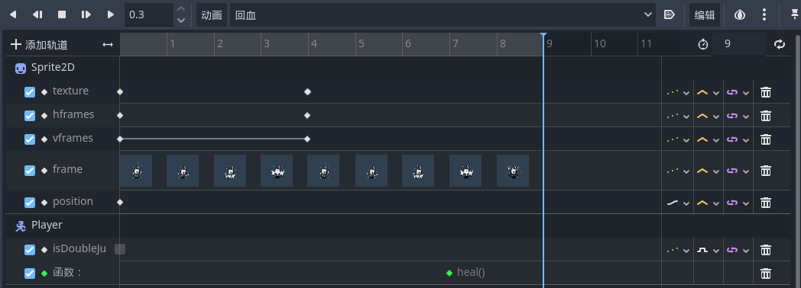

# 小骑士死亡和回血

首先按常规流程制作对应的动画

## 死亡

小骑士进入死亡的条件是`PlayerHealthBar <= 0`，如果寄了要把小骑士受伤的碰撞体`disable`掉，死了就不要再受伤了。这里先暂时将死亡逻辑只播放死亡1、死亡2的动画，不做其他改动，也就是死了就一直播放死亡动画

## 回血

回血这里有一定细节，除了需要添加键位映射、消耗灵魂等条件判断之外，还需要将回血函数添加到关键帧动画中：

```GDScript
func heal():
    $"/root/PlayerSoul".PlayerSoul -= 3
    $"/root/PlayerSoul".refresh_player_soul()
    $"/root/PlayerHealthBar".PlayerHealthBar += 1
    $"/root/PlayerHealthBar".refresh_player_health_bar()
```

上面是回血的函数，我们需要像下面这样把它关联到关键帧动画中，在动画播放到指定进度的时候调用它：



另外，这个动画中除了方法调用轨道的细节以外，还有个之前没有过的操作：这里的动画其实是由两个不同的`png`素材拼起来的关键帧动画，而要在同一个动画里面用多个不同的素材组合，可以通过对`hframes`、`vframes`、`frame`相关属性的关键帧调整实现
