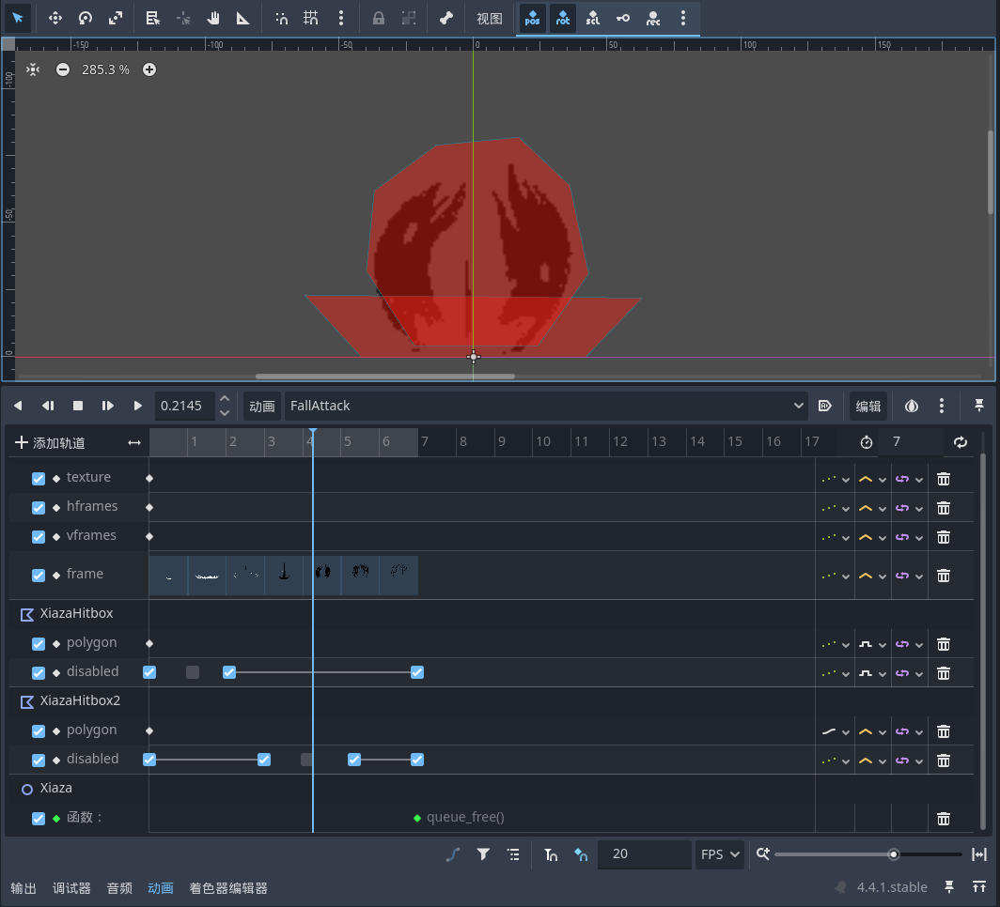

# 小骑士下砸

常规的动画制作，下砸特效也和之前的黑白波类似是动画播放过程中借助`fashu_spawner`“召唤”出来的，接着是状态机的添加

## 下砸状态机

我们在普通状态下满足下砸释放条件时进入下砸蓄力状态、随后进入下砸下落过程、最后落地进入下砸特效最后结束

## 下砸特效关键帧

下砸的关键帧和之前的黑白波法术有些不一样，因为下砸特效的碰撞体分两个阶段，需要分别制作对应的碰撞体关键帧：

## 下砸无敌的实现

原作中下砸过程和特效放完之后是有一小段无敌时间的，我们这里也跟着还原一下

在进入下砸过程状态时，将小骑士的受伤碰撞体`disable`掉，然后启动一个`Timer`开始计时，当计时结束的时候重回可受伤状态
