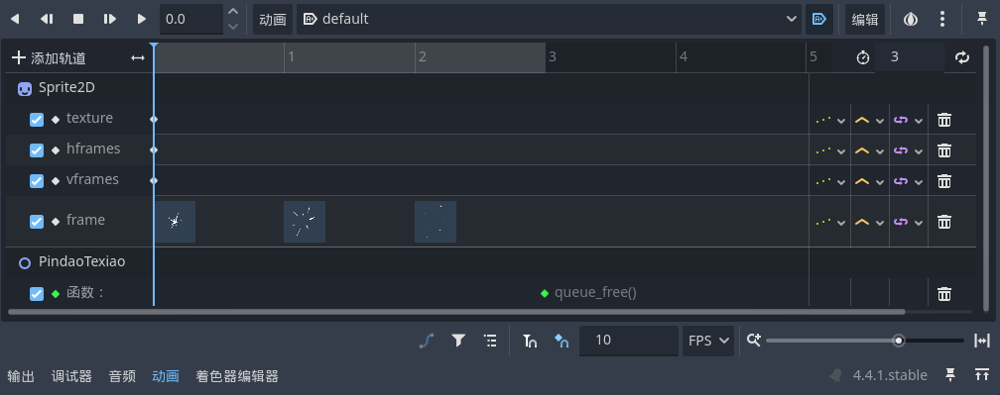

# 拼刀

让战斗变为华丽的舞蹈

总体思路是在小骑士刀光打到BOSS刀光的时候在两者之间播放拼刀特效并附带震动与子弹时间等效果

## 特效制作

拼刀特效本质也是个动画在拼刀触发的时候播放然后消除，与之前不同的地方在于这里我们打开动画名称旁边的“加载后自动播放”按钮，这样我们就不必和之前的每一个法术节点的制作一样再单独用代码给这个动画附上`$AnimationPlayer.play("XXX")`了：



## 特效生成

拼刀特效的生成其实和之前小骑士的法术类似是通过一个自建的`spawner`来控制：

```GDScript
func spawn_pindao_texiao(effect_pos):
    var pindao_scene = load("res://scenes/pindao_texiao.tscn")
    var pindao_node = pindao_scene.instantiate()
    pindao_node.position = effect_pos
    add_child(pindao_node)
```

即在指定位置实例化拼刀节点，然后加载该子节点后会自动播放其动画，并且我们在关键帧动画的末尾设置了播放完的对象释放

它的触发需要给定一个位置信息，这个位置通常可以设置为小骑士和BOSS位置的中点：

```GDScript
var pos1 = global_position
var pos2 = area.global_position
var effect_pos = (pos1 + pos2) / 2
```

并在触发拼刀后给予对应的视觉反馈：

```GDScript
$"/root/MainScene/Player/TexiaoSpawner".spawn_pindao_texiao(effect_pos)
$"/root/MainScene/GameCamera".pindao_camera()
```

## 拼刀无敌

原作中拼刀瞬间后有一小段无敌时间，看着就贼帅，这个可以通过一个`Timer`在触发拼刀时候关闭小骑士受伤碰撞体，然后计时结束之后重置来实现，不过这里有一个细节，你不能在当前帧既获取受伤碰撞体的信息又同时改变他是否生效的属性，否则会报错，所以需要延迟调用：

```GDScript
call_deferred("pindao_wudi")
```

### 延迟调用带来的问题

经过上面的操作确实能触发拼刀并且在拼刀过后的下一帧进入一个短暂的无敌状态，但是如果你触发拼刀的第一帧就已经站在BOSS攻击范围之内了，那么你会在当前帧先挨打受伤并在下一帧再开启无敌，这种效果看上去和预期不太相符

我尝试过新建一个`pindao_flag`来进一步在当前帧就开始标记拼刀状态，但是我实测发现这样时而奏效时而失效，我进一步分析猜测是由于`_on_hurtbox_area_area_entered`以及`_on_attack_1_area_entered`等不同信号在同一帧触发的顺序是不确定的，我试图上网寻找是否有方案能够手动控制它们之间的触发顺序但是无果

尝试与视频教程的作者沟通，得到答复后续应该会通过统一的无敌状态管理来优化
