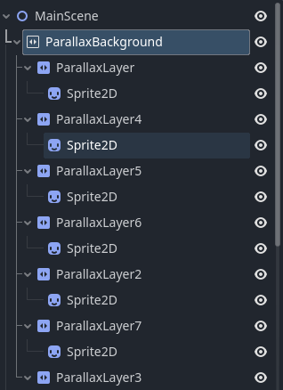
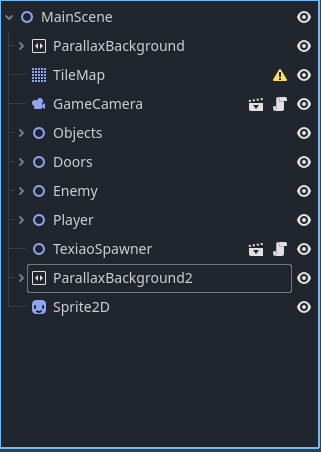
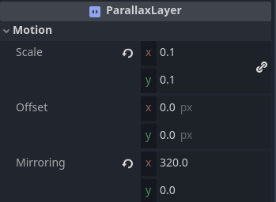
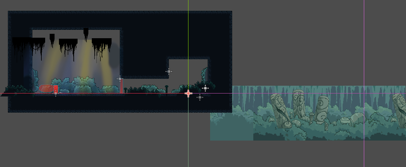

# 视差滚动背景

如果你有过空洞骑士、奥日等游戏的游玩经验，你会发现它们的游戏背景有一种层级效果，即随着角色的移动背景中不同层次的内容移动的速度是不同的，这样会营造出一种背景很立体的感觉，就好像被切分成了近景、远景、中景等多个部分，随着角色的移动而层叠交错，很有层次感

## 背景制作

Godot中本身有背景制作相关的节点`ParallaxBackground`、`ParallaxLayer`等等，然后我们借助`Sprite2D`来为它们附上图片材质

可以制作多个背景节点实现前景、后景的效果，让场景看上去更立体

## 不同层次的参数调整

不同层次背景随着角色的移动变化速度会不同，这个可以通过调整`ParallaxLayer`的参数实现：

但需要注意的是调整了`Motion`的`Scale`参数之后你的场景的位置可能需要一些偏移才能让显示效果正常，这个位置可以通过反复的运行调试来慢慢确定

