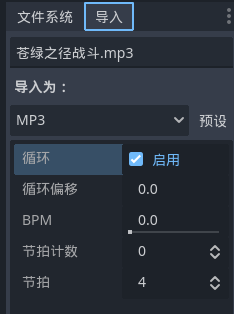
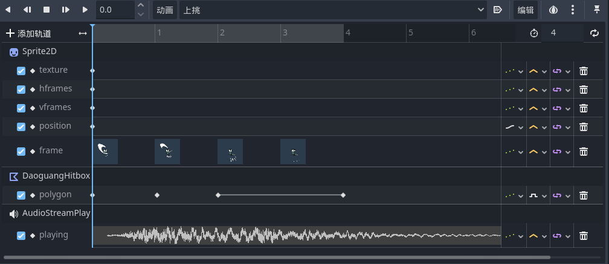

# 音乐与音效

游戏逻辑本身已经基本制作完毕了，接下来为游戏添加音效来增强打击感和游玩体验

## 音效导入

音效导入时一般需要注意一些默认属性的取值，比如循环是否打开等，如果和自己预期的效果不一致，可以选中所有需要更改的音效文件，然后在“导入”选项卡中进行统一设置：



## 音效添加

音效的添加需要借助`AudioStreamPlayer`节点，将要用的音效拽入`Stream`属性中，为`Playing`打上关键帧，如果打上关键帧之后发现播放动画没有音效就点击该轨道然后调整`Value`为“启用”即可：



除了在动画关键帧中添加音效，还可以在代码中予以控制。例如我们的拼刀音效可以在代码中触发拼刀的位置添加如下的代码来触发：

```GDScript
$"/root/MainScene/TexiaoSpawner".spawn_pindao_texiao(effect_pos)
$"/root/MainScene/GameCamera".pindao_camera()
if randf() > 0.5:
    $AudioStreamPlayer_Pindao.play()
else:
    $AudioStreamPlayer_Pindao2.play()
```

## 背景音乐

除了音效，还需要一个BGM来渲染一下氛围。

添加一个`Node`节点，并在其下添加`AudioStreamPlayer`，随后在关门时调用播放该音乐：

```GDScript
func close():
    $"/root/MusicManager".play_music()
    $AnimationPlayer.play("close")
```
