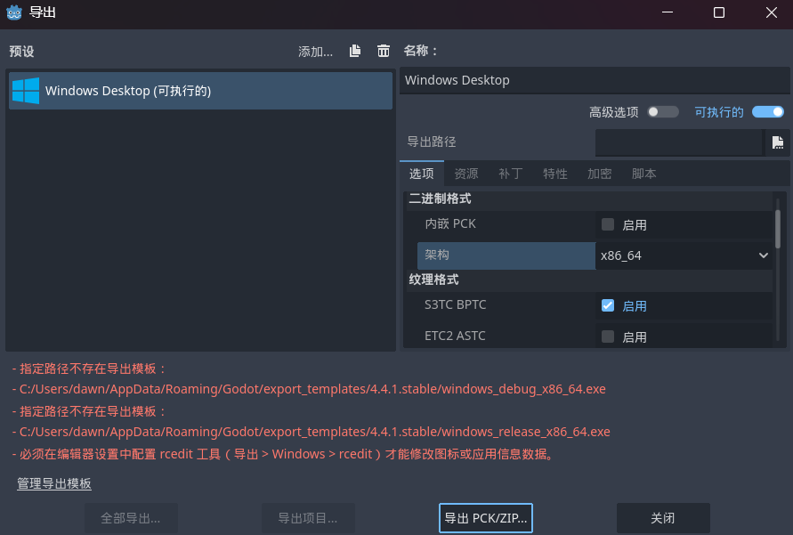

# 游戏导出

游戏制作完毕，是时候导出可运行的游戏发给朋友们试试了

## 导出模板

第一次使用Godot导出时候未下载模板会有警报信息，需要前去“管理导出模板”处下载

## 导出设置

下载完模板之后就可以配置信息并导出了

常规配置要修改导出的路径，即导出的游戏要放在哪儿，其他的选项按个人需求配置

## 食用方式

进入导出后的文件夹查看，会发现里面有`.exe`与`.pck`文件，双击`.exe`即可运行游戏
