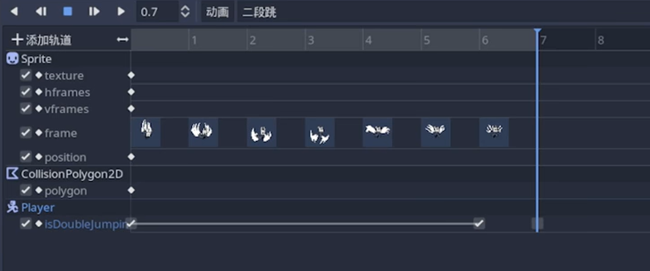

# 小骑士冲刺、二段跳

实现小骑士的小骑士冲刺、二段跳，并完善小骑士的状态机

动画的创建主要思路还是和之前一样，创建动画、调整参数、设置关键帧等

## 小骑士状态机

通过枚举定义各种状态，比如普通状态、冲刺状态，之后还会有攻击状态等

```GDScript
enum State {NORMAL, DASH}
var currentState = State.NORMAL
```

然后通过类似`switch`语句的思路根据状态进入不同的分支运行：

```GDScript
func _process(delta: float) -> void:
    match currentState:
        State.NORMAL:
            process_normal(delta)
        State.DASH:
            process_dash(delta)
```

添加键位映射并在对应的状态代码中添加状态切换的语句，安排得当就可以实现小骑士的基础状态机

这里根据状态机切换状态时候有个小细节：

```GDScript
call_deferred("change_state", State.DASH)
```

通过延迟调用来防止某些变量或者状态被覆盖

## 冲刺重置

一般游戏里都有冲刺限制或者是落地刷新机制，这里一般的操作方法是定义一个标志位变量，然后每次落地刷新：

```GDScript
if is_on_floor():
    canDash = true
    canDoubleJump = true
```

## 二段跳

二段跳的添加这里相比之前已有的动画有些许不同，这里二段跳需要将`isDoubleJumping`信息传递到代码之外来控制，如果单纯看代码会发现脚本中对`isDoubleJumping`的操作只有将其置为`true`但是却没有重置为`false`，因为这个过程是通过动画关键帧来实现的

想要在脚本之外操作`isDoubleJumping`，首先得把它导出来：

```GDScript
@export var isDoubleJumping = false
```

然后会发现`player`中多了这个属性，对它打上关键帧。在跳跃的过程中置为`true`并在最后一帧重置为`false`即可通过动画来控制`isDoubleJumping`的变化：



这样一来`isDoubleJumping`就正常了，只有在二段跳开始以及二段跳期间为`true`，其他时候会被重置为`false`
