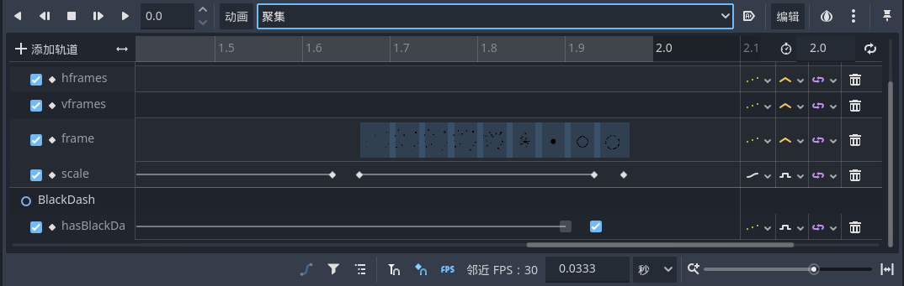

# 小骑士攻击、黑冲

首先依旧是动画制作，这一步基本都差不多

## 攻击状态机

小骑士的攻击本质也是一种状态机的设置，挥砍状态、上劈状态、下劈状态等，进入对应状态时候播放对应动画并调整其物理属性之类的

```GDScript
enum State {NORMAL, DASH, ATTACK, ATTACK_UP, ATTACK_DOWN}
```

如果只是单纯的根据状态机切换播放动画，那么在播放动画过程中小骑士会卡在原来的位置，我们希望它能在一边攻击的时候一变具有其他的物理性质，比如重力、正常的移动等等，为了复用，可以建个函数来完成：

```GDScript
func apply_gravity_movement(delta):
    var moveVector = get_movement_vector()
    velocity.x += moveVector.x * horizontalAcceleration * delta
    velocity.x = clamp(velocity.x, -maxHorizontalSpeed, maxHorizontalSpeed)
    if moveVector.x == 0:
        velocity.x = lerp(0.0, velocity.x, pow(2, -50 * delta))
    velocity.y += gravity * delta
    move_and_slide()
```

通过给定一个`index`变量来控制横劈的两种动画交替播放：

```GDScript
attack_index = 1 - attack_index
```

通过`Timer`可以限制触发攻击的间隔，每次攻击的时候触发`$AttackTimer.start()`，并在每次进入攻击状态之前检测`$AttackTimer.is_stopped()`来限制攻击的频繁触发

## 黑冲的实现

黑冲主要由两个部分组成：冲刺过程和聚集过程，而这里思路可以参考下之前二段跳的变量导出并在动画中以关键帧的方式编辑的办法来控制玩家的黑冲行为，而间隔时间则可以通过调整“聚集”动画的播放时间来实现，另外“聚集”动画的显示和隐藏可以通过`scale`的关键帧编辑实现：



随后就可以实现黑冲完毕变成普通冲刺，在聚集的冷却结束后又变成黑冲了
