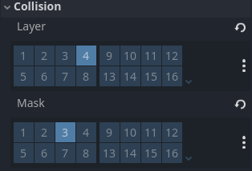

# 小骑士动作碰撞体

> [!Note]
> 这一章3.x版本和4.x版本会不太一样，主要由于是Godot4.x中的碰撞体检测的机制不同

## 新建物理层

首先在物理2D里面新建物理层，这里原教程是用了三层结构就可以完成，但是实测在4.x版本中完全照搬这样的作法是不太行的，因此我建了5层：


## 小骑士攻击碰撞体

对每一种攻击方式，新建对应的`Area2D`以及`CollisionObject2D`。对于小骑士的攻击，显然它属于`PLAYER_HITBOX`层，而它要去抓取`ENEMY_HURTBOX`层的信息



随后根据动画的像素范围为每一个攻击动作区域的碰撞体绘制对应的范围：


之后编辑每个攻击动画对应的关键帧信息，每一种攻击方式的碰撞体`disabled`关键帧只在对应动画的第一帧关闭，其他时候以及其他动画都开启（这里是`disabled`所以开启其实是禁用），以下劈为例子：


> [!Tip]
> 这里通过在“调试”中勾选“显示碰撞区域”再运行游戏可以在运行过程中实时显示场景各处碰撞区域的情况


之后运行会发现这个碰撞区域不会随着角色的转向而发生改变，于是我们操作一下`turn_direction`

```GDScript
func turn_direction(): 
    var moveVector = get_movement_vector()
    if moveVector.x !=0:
        $SpriteArea.scale.x = 1 if moveVector.x > 0 else -1
        $HurtboxArea.scale.x = 1 if moveVector.x > 0 else -1
        $Attack_1.scale.x = 1 if moveVector.x > 0 else -1
        $Attack_2.scale.x = 1 if moveVector.x > 0 else -1
        $Attack_Up.scale.x = 1 if moveVector.x > 0 else -1
        $Attack_Down.scale.x = 1 if moveVector.x > 0 else -1
        $CollisionPolygon2D.scale.x = 1 if moveVector.x > 0 else -1
```

再次在调试状态下运行就能看到碰撞区域跟着角色一起转向了

## BOSS的添加

新建一个场景添加BOSS，然后编辑BOSS的各种属性、动画等（这个步骤和之前操作小骑士是类似的），然后在主场景中链接BOSS，运行游戏就可以看到BOSS和小骑士同屏了

此时你让小骑士和BOSS走到一起可能会发现BOSS挡在小骑士前面了，我们在主场景中改变一下`Player`和`BOSS`的次序，让小骑士在下，BOSS在上，这样两者位置重合时就是小骑士在前面了

> [!Tip]
> 在Godot中同一场景的内容渲染顺序是从上到下的，越晚渲染的越是在画面的前面

## 节点链接

选择想要编辑的`Area2D`，在“节点”卡片栏可以看到它对应的一系列信号，选择对应的信号链接到目标主体上，会发现对应的脚本里面多出了一个函数，编辑这个函数的内容即可控制事件发生时会执行哪些事情
