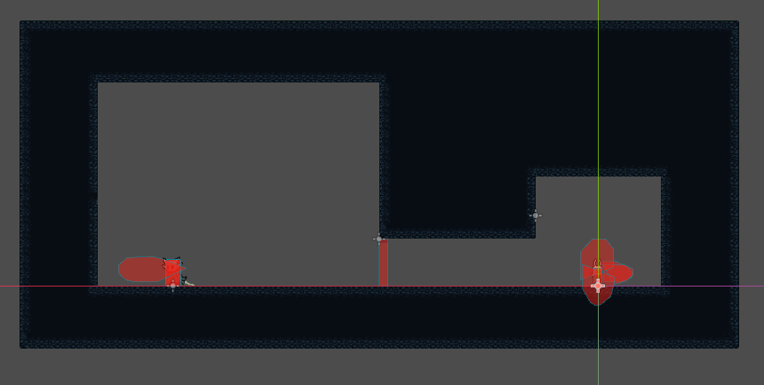

# 战斗基础场景搭建

## 地图绘制

首先使用之前已经做好的“地形”来绘制基础的地图，因为之前设置过掩码所以可以自动处理连接和填充，地图画起来还是比较方便的，画完之后再制作一个铁门（相关动画、碰撞体设置等）然后把它放在地图进入BOSS战前的位置

> [!Tip]
> 画地图时候可以用`Ctrl + Shift + 鼠标拖动`的快捷键方法快速填充一整块区域的地图



## 相机的移动控制

搭建好地图之后直接运行游戏会发现这个相机的范围不足以笼罩整个地图，角色移动的时候相机不会自适应调整位置，于是我们为相机添加脚本控制相机的移动

主要思路是当小骑士走在地图边缘的时候相机卡在边缘位置不跟着小骑士走，当小骑士处在左右地图都可以延申的位置时相机则跟着小骑士平滑移动，而当小骑士进入BOSS站场景时则相机平滑跳转到BOSS战场景中并固定

这就需要先获取小骑士的位置：

```GDScript
func match_player_position():
    var players = get_tree().get_nodes_in_group("player")
    if players.size() > 0:
        var player = players[0]
        playerPosition = player.global_position
```

然后按照小骑士的位置分支不同情况的处理：

```GDScript
func _process(delta: float) -> void:
    match_player_position()
    if playerPosition.x > -210 and playerPosition.x < -64:
        global_position.x = lerp(playerPosition.x, global_position.x, pow(2, -7 * delta))
    if playerPosition.x < -210:
        global_position.x = lerp(-370.0, global_position.x, pow(2, -7 * delta))
    if playerPosition.x > -64:
        global_position.x = lerp(-64.0, global_position.x, pow(2, -7 * delta))
```

这里视角的移动使用了`lerp`进行平滑处理看起来更舒适，另外采用了`pow(2, -7 * delta)`而不是直接给定一个固定系数，使用「自适应时间的指数衰减系数」解决固定系数在帧率波动时的效果不一致问题
